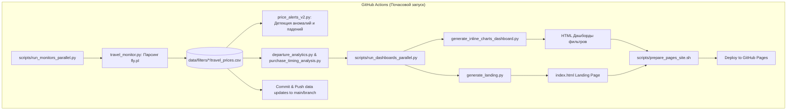

# 🗺️ Project Context — Travel Price Monitor

## 📌 Обзор проекта

**Travel Price Monitor** — это распределённая система мониторинга, сбора, статистического анализа и визуализации цен на пакетные туры с польского агрегатора **fly.pl**. 
Система работает непрерывно через **GitHub Actions CI** (почасовой cron) и разворачивает интерактивные веб-дашборды на **GitHub Pages**.

---

## 🏗️ Архитектура системы



---

## 📂 Структура директорий

```
travel-price-monitor/
├── .agents/                      # Конфигурации и правила для AI-агентов
│   └── rules/
│       └── git_safety.md        # Критические правила безопасности Git
├── .github/workflows/
│   └── travel_monitor_sequential.yml  # Главный CI/CD пайплайн (мониторинг + деплой)
├── config_ci_filter_*.json       # Конфигурации фильтров (даты, направления, бюджеты)
├── data/
│   └── filters/                 # Хранилище исторических данных по фильтрам
│       ├── filter_7_10_days/
│       │   ├── travel_prices.csv             # Накопительная история цен
│       │   ├── travel_prices_alerts.json     # Актуальные ценовые алерты
│       │   ├── departure_cohorts.csv         # Снимки динамики цен вылетов
│       │   └── hotel_series/                 # Временные ряды цен по каждому отелю
│       └── ... (другие фильтры)
├── scripts/
│   ├── run_monitors_parallel.py   # Параллельный запуск парсеров fly.pl
│   ├── run_dashboards_parallel.py # Параллельная генерация всех HTML-дашбордов
│   └── prepare_pages_site.sh     # Сборка артефактов для GitHub Pages
├── travel_monitor.py             # Основной парсер fly.pl (HTTP requests + Playwright fallback)
├── generate_inline_charts_dashboard.py # Генератор самодостаточных интерактивных HTML-дашбордов
├── generate_landing.py           # Генератор главной страницы (index.html)
├── hotel_deal_score.py           # Алгоритм Deal Score (0–100) с интеграцией TripAdvisor
├── purchase_timing_analysis.py   # Статистика лучшего времени покупки (час, день недели, месяц)
├── departure_analytics.py        # Аналитика по аэропортам вылета и когортам дат
├── departure_airports.py         # Сопоставление и группировка аэропортов вылета
├── duration_view_bundle.py       # Пакетная генерация представлений для корзин длительности
├── filter_params.py              # Парсинг и рендеринг параметров фильтров
├── filter_registry.py            # Реестр и метаданные фильтров
└── filter_trip.py                # Утилиты фильтрации и валидации конфигураций
```

---

## 🔑 Ключевые модули и алгоритмы

### 1. Парсинг данных (`travel_monitor.py`)
- Запрашивает выдачу `fly.pl` по API/HTTP с эмуляцией заголовков.
- В случае строгой защиты или отсутствия данных переключается на Playwright Chromium headless.
- Дописывает свежие наблюдения в `data/filters/<filter_name>/travel_prices.csv`.
- Автоматически парсит URL оферт, извлекая дату вылета, длительность, тип питания, аэропорт вылета и ID отеля.

### 2. Алгоритм Deal Score (`hotel_deal_score.py`)
- Вычисляет оценку выгодности предложения от **0 до 100** для каждого отеля на основе:
  - Текущей цены относительно исторического минимума и максимума отеля.
  - Положения текущей цены в историческом распределении цен отеля (квартили/процентили).
  - Интеграции рейтинга TripAdvisor (`blend_tripadvisor_into_deal_score`), где качественные отели со скидкой получают повышенный балл.

### 3. Анализ времени покупки (`purchase_timing_analysis.py`)
- Исследует вероятность падения цены тура в зависимости от:
  - Часа суток (по времени Варшавы).
  - Дня недели.
  - Части месяца (начало, середина, конец).
  - Месяца сезона.
- Строит доверительные 95% интервалы Уилсона и тепловые карты интенсивности снижения цен (день недели × час).

### 4. Аналитика аэропортов и когорт (`departure_analytics.py`, `departure_airports.py`)
- Отслеживает кривые изменения цен перед вылетом ($D-14 \dots D-0$).
- Группирует вылеты по хабам (Польша: Варшава, Катовице, Краков, Гданьск, Познань, Вроцлав и др.).
- Сравнивает минимальные цены одного направления из разных аэропортов.

### 5. Интерактивный дашборд (`generate_inline_charts_dashboard.py`)
- Генерирует автономный HTML со встроенными скриптами и данными JSON.
- **Стек интерфейса:** Vanilla JS + CSS Grid/Flexbox + Plotly.js 2.35.2.
- **Поддерживаемые функции:**
  - Сайдбар навигации по фильтрам.
  - Переключение режимов отображения: **Карточки** (визуальный обзор) ↔ **Таблица** (быстрый поиск и сортировка).
  - Ценовой календарь минимальных цен по датам вылета (тепловая карта).
  - Графики цен ТОП-10, динамики предложений и лучшего времени покупки.
  - Персистентность состояния свёрнутых/развёрнутых блоков (`<details>`) и темы в `localStorage`.
  - Модальные окна с детальной историей цен конкретных оферт и аэропортов.

---

## ⚙️ CI/CD и деплой

1. **GitHub Actions Workflow:** `.github/workflows/travel_monitor_sequential.yml`
   - Запуск каждый час по расписанию (`cron: "0 * * * *"`), при push в `main`/`feature/debug-ci-monitoring`, или вручную (`workflow_dispatch`).
   - Запускает `scripts/run_monitors_parallel.py` (3 параллельных воркера).
   - Запускает `scripts/run_dashboards_parallel.py` для генерации страниц.
   - Запускает `scripts/prepare_pages_site.sh` для подготовки статики.
   - Деплоит на **GitHub Pages**.
   - Фиксирует и пушит обновлённые файлы `data/filters/` в ветку.
